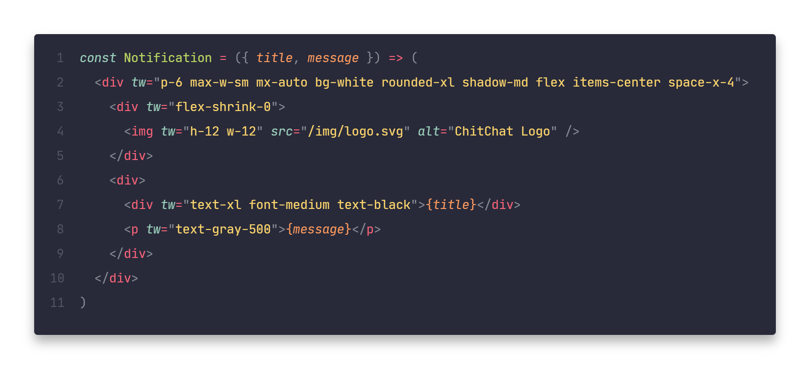

# Twind JSX Preprocessors

Monorepo for adding JSX enhancements to [Twind](https://twind.dev), including the `tw` prop, and various compile-time optimizations ✨

## Install

To enable the preprocessor, use one of these integrations:

- [Babel Macro](./packages/macro/README.md)
- [Vite Plugin](./packages/vite-plugin-jsx/README.md)

## Features

- [`tw` prop](./docs/tw-prop.md)

## Contribute

Thanks for being willing to contribute!

> This project is free and open-source, so if you think this project can help you or anyone else, you may [star it on GitHub](https://github.com/tw-in-js/twind-jsx-preprocessor). Feel free to [open an issue](https://github.com/tw-in-js/twind-jsx-preprocessor/issues) if you have any idea, question, or you've found a bug.

**Working on your first Pull Request?** You can learn how from this _free_ series [How to Contribute to an Open Source Project on GitHub](https://egghead.io/series/how-to-contribute-to-an-open-source-project-on-github)

We are following the [Conventional Commits](https://www.conventionalcommits.org) convention.

### Develop

Clone the repository and cd into the project directory.

Run `yarn install`.

- `lerna run test`: Run test suite including linting
- `lerna run format`: Ensure consistent code style
- `lerna run build`: Build all packages
- `lerna publish`: To publish all changed packages

## License

[MIT](https://github.com/tw-in-js/twind-jsx-preprocessor/blob/main/LICENSE)
